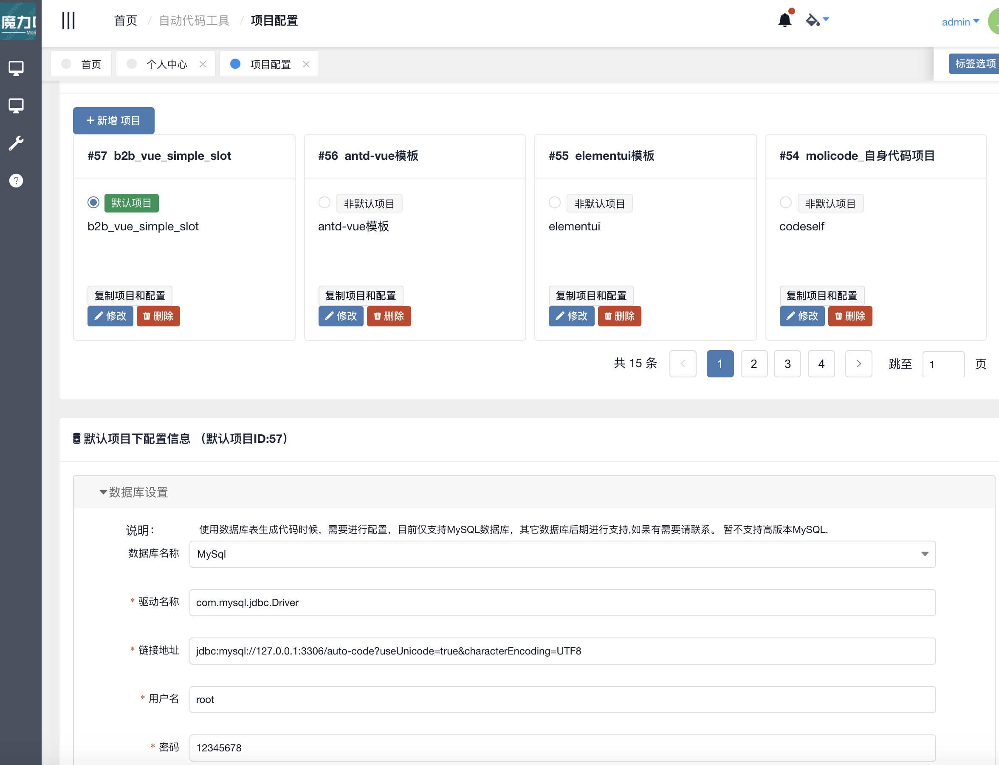

# MoliCode 源码仓库主页

## （介绍） Introduce

MoliCode是基于java开发的一种代码生成器，当然其除了生成java代码亦可生成其它代码。 它是一个独立(standalone)的工具，用于在git仓库存储代码模板并依此生成目标代码。 它和其它代码生成器的最主要区别在于，其关注点不在模板本身。 即不关注生成了什么样的代码，而是作为一个基础工具方便大家编写和共享使用代码模板。

MoliCode  is a code generator for java and other language. It's a standalone tool to generate code and store code template in git repository . So I want to make a good tool for everybody to share their code template and generate code easier. that's it.

代码生成操作，可以通过数据库表模型直接生成代码，UI界面直接配置，一键生成代码，非常方便。

## 代码仓库

* github仓库 [https://github.com/cn2oo8/molicode](https://github.com/cn2oo8/molicode)

* 国内站点仓库 [https://gitee.com/zhangshibin1987/molicode](https://gitee.com/zhangshibin1987/molicode)
* oschina 项目介绍页 [https://www.oschina.com/p/molicode](https://www.oschina.com/p/molicode)

> 近期美国佬可能限制部分国家使用github, 所以之后会逐渐迁移到国内服务器；
> github的issue & star 等无法迁移，建议大家转移到gitee为主进行访问；

## 下载使用
* 已提供二进制编译版本可供下载使用：
[https://gitee.com/zhangshibin1987/molicode/releases](https://gitee.com/zhangshibin1987/molicode/releases)

* 在线试用
[http://molicode.shareyi.com](http://molicode.shareyi.com)

>用户请自行注册；
>因为涉及模板动态化风险，为保证 朋友提供的服务器，访客目前只能使用模板，不能进行配置和链接数据库，请见谅！
>您可以下载在本地使用，即可拥有完全权限，谢谢支持理解；

## 帮助文档 & 教程
请访问以下地址，查看帮助文档：
[https://cn2oo8.github.io/molicode_doc](https://cn2oo8.github.io/molicode_doc)

模板中心请访问：
[https://gitee.com/molicode_repo/molicode_template_awesome](https://gitee.com/molicode_repo/molicode_template_awesome)

MoliCode使用介绍视屏教程：

* 西瓜视频: [https://www.ixigua.com/i6721698395569783304/](https://www.ixigua.com/i6721698395569783304/)

* 优酷：[https://v.youku.com/v_show/id_XNDMwMTg5ODQ3Mg==.html](https://v.youku.com/v_show/id_XNDMwMTg5ODQ3Mg==.html)

### MoliCode 模板开发教程
请访问以下地址，按章节进行学习(附视屏教程)

[https://gitee.com/molicode_repo/molicode-template-study](https://gitee.com/molicode_repo/molicode-template-study)

模板开发中遇到任何问题，请在QQ群众沟通，或者在项目下留言！

### 使用案例

* molicode生成工程代码实战: [https://my.oschina.net/davidzhang/blog/3036548](https://my.oschina.net/davidzhang/blog/3036548)

* 使用molicode进行json数据处理 [https://my.oschina.net/davidzhang/blog/3034658](https://my.oschina.net/davidzhang/blog/3034658) 

* 使用molicode处理Java源代码 [https://my.oschina.net/davidzhang/blog/3036589](https://my.oschina.net/davidzhang/blog/3036589) 

* 使用molicode生成excel [https://my.oschina.net/davidzhang/blog/3036540](https://my.oschina.net/davidzhang/blog/3036540) 

## 社交
QQ群名称：molicode技术交流群   群号：753207541

欢迎加入沟通交流答疑群；

## 源码理解学习

请参考：

[源码及开发环境搭建](./doc/devIntroduce.md)

## 使用图例

### 项目列表示意图

### 项目下模板仓库地址配置
配置模板git地址，并拉取git模板到本地使用；

 如果为一个git仓库有多个模板集合，需要配置模板相对路径（在git仓库根路径下的子文件夹名称）；

### 代码生成
如果项目已经设置完成，则可以进行代码生成了。
代码生成->刷新模板

代码生成->拉取数据库生成代码

代码生成-> 代码预览

## The name 
Because I like jasmine flower , and I have planted many jasmine flower On my Balcony . So I named it moli, that's the Chinese pronunciation of jasmine flower. meanwhile the 'moli' has the meaning of magic in chinese, So I hope this auto code generator will have the magic power to help every one save time of dumping code.
                                                                                                       
 Moli is white and with delicate fragrance and have magic power to make your life joyful.            

## tech stack
springboot + iveiw admin + H2 embeded database + swing ui + JXBrowser(evaluate version).  
Thanks for so many open source software we can use.

## Author
David Zhang from chengdu of China (Panda hometown).

