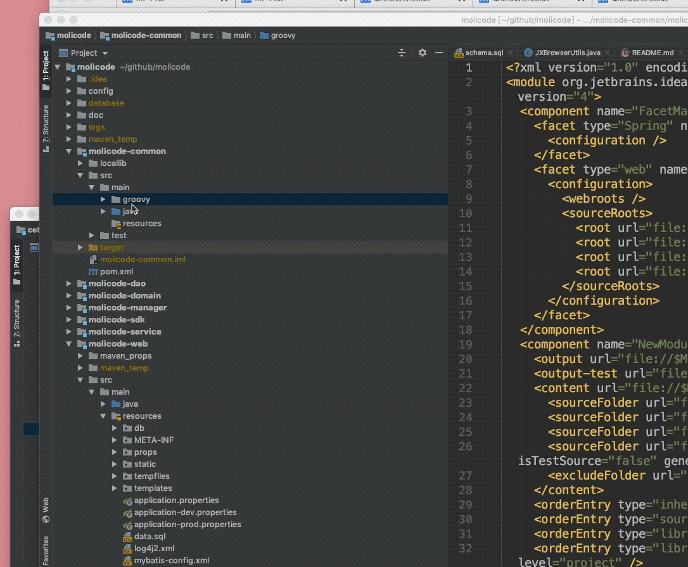

# 源码及开发环境搭建

针对需要阅读源码和进行二次开发的朋友，在这里对工程进行一些简单介绍。


## 技术栈

* 工程后台：maven + springboot + springmvc + mybatis + druid ;
* 工程前台： iviewAdmin + vue + webpack;

* 语言:  Java + groovy 混合编译；


## 开发环境特别说明

建议使用idea打开项目；

因为idea及其它IDE一般无法识别 groovy的源码路径，所以需要对多个子模块下的groovy文件夹设置为源码目录：涉及到的目录有：

```shell
#以下目录需要进行设置
molicode-common/src/main/groovy
molicode-service/src/main/groovy
```

操作如下图所示：




## UI调整

在application.properties配置文件中：

```properties
#jxBrowser, 内置浏览器，体验就好，适合本地开发
browser.windowName=jxBrowser

#swing窗口
browser.windowName=swing

#headless 无窗口，浏览器访问，适合放在服务器上
browser.windowName=headless

```


##  开发模式

在application.properties配置文件中：

```properties
# 调整开发环境为 dev,   prod为线上模式
spring.profiles.active=dev
```

开发数据库配置请查找：

application-dev.properties  或者 application-prod.properties 两个不同的配置文件中；


系统采用flyway， 会自动进行建表和数据初始化，如果未成功，请手动建立：

molicode-web/src/main/resources/db/*.sql 复制SQL到自己的MySQL中进行执行。


有任何问题请加QQ群沟通：

QQ群名称：molicode技术交流群   群号：753207541

